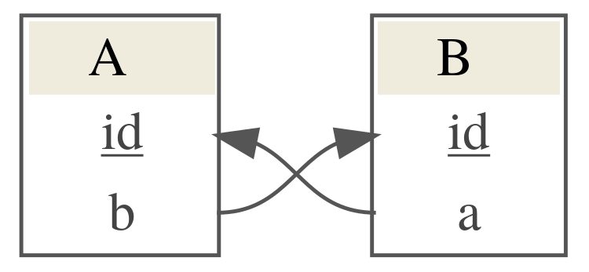

```{r setup, include = FALSE}
knitr::opts_chunk$set(
  collapse = TRUE,
  comment = "#>"
)
default_reporter <- testthat::default_reporter()
options(testthat.default_reporter = "summary")
```


Dettl provides a way to make data tidying and ingestion into a database easier, more testable and more robust. We do that by employing an ETL (extract, transform, load) like workflow to separate out different concerns of your data import and allow testing after each stage.

## ETL

ETL is a pattern for general copying of data from one or more sources to another destination which expects the data in a different form from the sources. It consists of three basic steps

**Extract** - Step is responsible for selecting and accessing any required data from relevant sources (local files or DB). The data is read into memory and can be verified by running a set of tests after step has completed.

**Transform** - Step is responsible for transforming the extracted data into a form ready for loading into the destination database. Expect this is where the bulk of the work will be done. The transformed data can be verified by running a set of tests after the step has completed.

**Load** - Step is responsible for loading the transformed data into the destination database. A set of post-load tests can be defined which will be run after the data is loaded into the database. If any of the tests fail the DB update will roll back, otherwise changes are committed.

## Repository setup

Dettl requires a config at the top level of a repository called `dettl_config.yml` which describes database connection information. Individual imports are then organised in separate subdirectories and must contain a config file `dettl.yml` which contains information relating to the import mode, files to be sourced and tests to be run. These subdirectories will be created automatically by using `dettl_new`.

A typical repository might look like

```
project_directory
|── import_1
|   |── dettl.yml
|── import_2
|   |── dettl.yml
|── other imports ...
|── dettl_config.yml
```

## dettl_config.yml

This needs to be setup manually and contains configuration at the project level used to configure DB connection information for any database which you wish to import to. Note that you must specify a `log_table` where run information is written after each import. See below for an example setup.

```yaml
db:
  test:
    driver: RSQLite::SQLite
    args:
      dbname: test.sqlite
    log_table: dettl_import_log
  uat:
    driver: RPostgres::Postgresql
    args:
      dbname: montagu
      host: https://example.com
      port: 12345
      user: example
      password: password
    log_table: dettl_import_log
```

## Creating a new ETL import

If you want to create a new import within an existing project this can be done by opening the project as an RStudio project and using `dettl_new()`. 

```
import_name <- dettl::dettl_new("person_information")
```

This will create a new directory called `person_information` prepended with the current date containing:
* the default `dettl.yml` config - by default setup to run in append mode using automatic load
* an R file `R/extract.R` containing a template extract function
* an R file `R/transform.R` containing a template transform function
* an R file `R/verification_queries.R` containing test queries for load stage
* 3 test files `tests/test_extract.R`, `tests/test_transform.R`, `tests/test_load.R` containing testthat templates for testing after each stage of the import

If you want to create a new import within a new project then you will need to manually create a new RStudio project and create a `dettl_config.yml` file. You can then proceed as above.

## Developing it

### Extract

## Developing the import

To develop a complete import you need to implement the extract and transform stages.

Open the created `R/extract.R` file and implement the templated `extract` function. This can delegate to other R functions written elsewhere. If you add any other R files they will need to be added to the list of `sources` in the `dettl.yml`. The extract code should just read data the required data into memory and do no more. For our simple example we want to read from a csv.

```r
extract <- function(con) {
  raw_data <- list()
  raw_data$people <- read.csv("data/people.csv", stringsAsFactors = FALSE)
  raw_data
}
```

You should also define some tests for this stage in the `R/test_extract.R` file. These are written using the [testthat package](http://r-pkgs.had.co.nz/tests.html). The extracted data is made available via the variable `extracted_data` which can be used from within the configured test file. An example test to check that our extract function has extracted 3 rows of data would be.

```r
context("extract")

testthat::test_that("extracted data contains 3 rows", {
  expect_equal(nrow(extracted_data$people), 3)
})
```

After completing the implementation of the extract stage you can run just that step to check that the extracted data looks as expected. Note that the directory must be under version control and up to date with remote to run the import. This check is skipped if running in `dry_run` mode. See [Running the import](#run) for more details about this. When creating a new import also pass the database which this import is for, this must match one of the databases configured in the `dettl_config.yml`. See example below for a previously configured example. Note that `import_path` is the path to an import directory with structure like above.


```{r include = FALSE}
path <- dettl::prepare_test_import(
  system.file("examples", "person_information", package = "dettl"),
  system.file("examples", "dettl_config.yml", package = "dettl"))
import_path <- file.path(path, "person_information")
```

```{r}
import <- dettl::dettl(import_path, db_name = "test")
import$extract()
extracted_data <- import$get_extracted_data()
```
The extracted data can be inspected to ensure it looks as expected.
```{r}
print(extracted_data)
```

### Transform

Open the created `R/transform.R` file. Again you need to implement the templated `transform` function. Similarly to the extract stage this can delegate to other R functions if any files used are added to the `sources` block in the config. Similarly you should write some tests for the transformed data. Important to note is the form of the returned data should be as a named list of data frames. Where each list item represents a table from the database with name matching the name in the DB schema. And each column in the data frame should match an existing column in the database. After the transform step is run the user specified tests will be run automatically, in addition to these we test that the returned data conforms to the DB schema and fail if it does not do so. For example for our simple people example our transform code could be something like

```r
transform <- function(extracted_data) {
  transformed_data <- list()
  transformed_data$people <- extracted_data$people[which(extracted_data$people$age < 50), ]
  transformed_data
}
```

and our user defined test

```r
context("transform")

testthat::test_that("transformed data contains 2 rows", {
  expect_equal(nrow(transformed_data$people), 2)
})
```

Like with developing the extract stage you can now run the import up the transform step to check it is working though you should try to add any checks required for accepting the transform stage to the test file.

```{r}
import$transform()
transformed_data <- import$get_transformed_data()
```

The transformed data can be inspected to ensure it looks as expected.
```{r}
print(transformed_data)
```

### Load {#dettl_auto_load}

By default dettl will use an automatic load step to write data to the database. At its most simple this will just take the named list of `transformed_data` and append each of these data frames to the table in the database with matching name. To use the automatic load step requires defining that the automatic load should be used in the load block of `dettl.yml` e.g.

```yml
load:
  automatic: TRUE
  verification_queries: test_queries
  test: R/test_load.R
```

The automatic load will load data respecting primary key constraints which are read automatically from the database. For example if we want to load data where we have `transformed_data` taking the form

```{r echo = FALSE}
people <- data.frame(c(1,2),
                     c("Alice", "Bob"),
                     c(25, 45),
                     c(175, 187),
                     stringsAsFactors = FALSE)
colnames(people) <- c("id", "name", "age", "height")
jobs <- data.frame(c(1, 2),
                   c("researcher", "developer"),
                   stringsAsFactors = FALSE)
colnames(jobs) <- c("person", "job")
knitr::kable(people, caption = "people")
knitr::kable(jobs, caption = "jobs")
```

where `id` is the primary key of table `people` which is used as a foreign key for the `person` column of table `jobs`. To support linking between these tables in the transformed data use temporary unique ids to associate the new rows of data with each other. The tables themselves may already have entries with these primary keys used so when the automatic load is run the primary keys are updated when a new record is added. If you want to link to an existing entry in the database by its primary id then use that exact id as the field value.

Note that the default automatic load will only append to existing tables, if you need to create new tables see [create mode](#create_mode). 

The important implementation for this stage is the testing. The load stage will be run in a transaction then the tests will be run. If any of the tests fail the transaction will be rolled back, otherwise it will be committed. You can write two types of test here, the first simplest is using the active connection to the database to query the loaded data and test the output. For example

```r
context("load")

testthat::test_that("people has 2 rows 2", {
  expect_equal(DBI::dbGetQuery(con, "SELECT count(*) from people")[1,1], 2)
})
```

These type of tests can only be used to look at the DB after the load has been done. You can also define tests which can test for changes in the DB between before and after the load has run. These require 2 steps.

First you need to define a function to query the database to get data you're interested in. e.g.

```r
test_queries <- function(con) {
  values <- list()
  values$count <-  DBI::dbGetQuery(con, "SELECT count(*) from people")[1,1]
  values
}
```

This should write the data into a list with meaningful names as these names will be used in the test. You need to then define the function used in the `dettl.yml` config in the `load` block using the following,

```yaml
load:
  func: load
  verification_queries: test_queries
  test: R/test_load.R
```
Making sure any additional R files have been added to the `sources` block. The `verification_queries` will be then run before and after the DB update has been run and the output made available to the tests as lists `before` and `after` so differences can be tested e.g.

```r
context("load")

testthat::test_that("No of rows in people increases by 2", {
  expect_equal(after$count, before$count + 2)
})
```

After this stage has been implemented the import can be run end-to-end.

## Running the import {#run}

The import can be run in one of two ways. You can either run the import up to a specified stage with one function call or if you require more control you can initialise an import object and run each stage step by step.

### Run functions

To use the run functions to run an import up to a specified stage you need to know the path to the import and the name of the database you want to use for the import. You can leave the `db_name` field blank to use the first database configured in the `dettl_config.yml` file. The extract function returns the extracted data.

```{r include = FALSE}
path <- dettl::prepare_test_import(
  system.file("examples", "person_information", package = "dettl"),
  system.file("examples", "dettl_config.yml", package = "dettl"))
import_path <- file.path(path, "person_information")
```

```{r}
extracted_data <- dettl::dettl_run_extract(import_path, db_name = "test")
```

The transform function runs the extract stage and then the transform stage and returns the transformed data.

```{r}
transformed_data <- dettl::dettl_run_transform(import_path, db_name = "test")
```

You can run the import end to end using `dettl_run_load`. This will make changes to the database unless run in `dry_run` mode.

```{r}
dettl::dettl_run_load(import_path, db_name = "test")
```

### Working with import object

To run the import using the object first create a new import object using the name of the directory containing the import you want to run. Again note that the `import_path` here is the path to import directory.

```{r include = FALSE}
path <- dettl::prepare_test_import(
  system.file("examples", "person_information", package = "dettl"),
  system.file("examples", "dettl_config.yml", package = "dettl"))
import_path <- file.path(path, "person_information")
```

```{r}
import <- dettl::dettl(import_path, db_name = "test")
```

You can then run the import by running

```{r}
import$extract()
import$transform()
import$load()
```

This will fail if any of the stages fail. 

You can run the import up to just a specific point to view the output if desired - which should be useful for debugging any import problems e.g.

```{r include = FALSE}
## Get a clean DB for running import a second time
path <- dettl::prepare_test_import(
  system.file("examples", "person_information", package = "dettl"),
  system.file("examples", "dettl_config.yml", package = "dettl"))
import_path <- file.path(path, "person_information")
import <- dettl::dettl(import_path, db_name = "test")
```
```{r}
import$extract()
import$transform()
```

Will run just the `extract` and `transform` stages of the import. Note that when any stage is run we automatically run any of the tests associated with that stage which have been configured. You can use the import object to view the extracted or transformed data.

```{r}
extracted_data <- import$get_extracted_data()
transformed_data <- import$get_transformed_data()
```

You can then run the load stage once you are satisfied the transformed_data looks coorect.

```{r}
import$load()
```

We can then inspect the database to see that the data has indeed been loaded
```{r}
con <- import$get_connection()
DBI::dbGetQuery(con, "SELECT * FROM people")
```

### Dry run

The import can be run in `dry_run` which will be useful for development. 

```{r include = FALSE}
## Get a clean DB for running dry run import
path <- dettl::prepare_test_import(
  system.file("examples", "person_information", package = "dettl"),
  system.file("examples", "dettl_config.yml", package = "dettl"))
import_path <- file.path(path, "person_information")
import <- dettl::dettl(import_path, db_name = "test")
```
```{r}
import$extract()
import$transform()
import$load(dry_run = TRUE)
```

This will rollback any changes which have been made to the database before the connection is closed. Note that it also skips the check that the git repository is up to date with remote and so should be used when developing the import.

```{r echo = FALSE, results = "hide"}
## Reset default reporter.
options(testthat.default_reporter = default_reporter)
```


## Other stuff

### I want to write an import which creates a table {#create_mode}

If you want to create a table during your import you need to switch the import mode. This is done in the `dettl.yml` configuration

```
mode: create
```

Create mode imports will skip some of the checks append imports do e.g. checks that the transformed data matches tables in the DB schema. The automatic load can still be used and will create each of the tables in the transformed data. Note that create and appending to tables cannot be mixed within an import.

### I want to write a custom load

Dettl allows writing a custom load if the automatic load does not achieve desired effect. You might want to use a custom load if you want to run an `UPDATE` query on the database. To do this update the `dettl.yml` for the report to use a user defined load

```yaml
load:
  func: load
  verification_queries: test_queries
  test: R/test_load.R
```

then add a function matching the name specified in the config, in our example this is just `load` which takes the transformed data and a DB connection e.g.

```R
load <- function(transformed_data, con) {
  ## Do something
}
```

Note that the containing file must be in the list of sources for the import.
Expect that this stage is only really a set of update queries to be run on the database implemented in R.

### I want to use the automatic load but make additional changes to the database

You can define two additional actions to the load step, `pre_load` and `post_load`. This might be used e.g. to create an index after the data has been added by the automatic load. These can be used by updating the `dettl.yml` config to be

```yaml
load:
  pre: pre_load
  automatic: TRUE
  post: post_load
  verification_queries: test_queries
  test: R/test_load.R
```

defining functions `pre_load` and `post_load` which take the `transformed_data` and a DB connection e.g.

```R
pre_load <- function(transformed_data, con) {
  ## Do something
}
post_load <- function(transformed_data, con) {
  ## Do something
}
```

Note that the containing file must be in the list of sources for the import.

### What about cycles?

If you have cycles in your database, for example something which looks like

```{r cycle_example, echo=FALSE, out.width = '100%'}

```

Then the automatic load can resolve these dependencies if at least one of them is nullable.

e.g. if we want to upload data like

```{r echo = FALSE}
data <- list(
  A = data.frame(
    id = c(1, 2),
    b = c(1, 2)
  ),
  B = data.frame(
    id = c(1, 2),
    a = c(NA, NA)
  ))
print(data)
```

this would work. The automatic load would determine that we have a dependency of `A` on `B` and of `B` on `A` but it would ignore the dependency from `B` on `A` because the column in the `B` table has `NA` values. It would upload `B` first which would pass successfully if column `a` of table `B` is nullable and then would successfully upload table `A`. 

If we had something like

```{r echo = FALSE}
data <- list(
  A = data.frame(
    id = c(1, 2),
    b = c(1, 2)
  ),
  B = data.frame(
    id = c(1, 2),
    a = c(1, 2)
  ))
print(data)
```

This would fail because the automatic load cannot determine the order that the data should be uploaded in.
